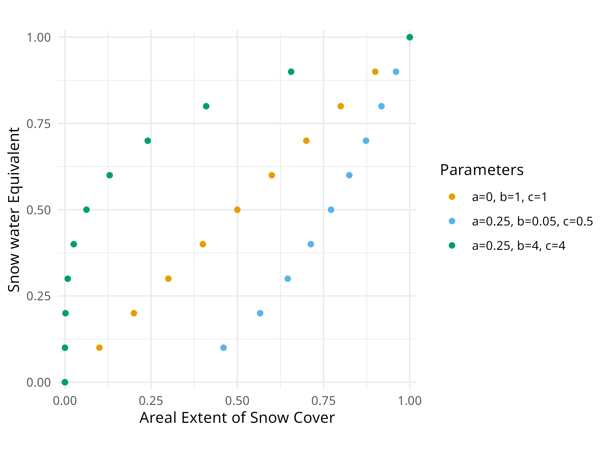

# 3-Parameter Areal Depletion Curve (ADC)

## Overview

This BMI Snow17 implementation supports both the 11-parameter ADC and 3-parameter ADC calibration method. The 3-parameter approach uses a non-linear polynomial formula inspired by the NWRFC `nwsrfs-hydro-models` repo methods.

## Background

The Snow17 model uses an Areal Depletion Curve (ADC) to represent how snow-covered area is related to areal snow water equivalent. Traditionally, this is specified as 11 discrete points from 0.0 to 1.0 in 0.1 increments.

The 3-parameter approach uses three calibration parameters (a, b, c) and calculates the 11 points along a non-linear curve, while maintaining the minimum adc value threshold of 0.05 mentioned in the snow17 manual.

## 3-Parameter ADC Formula

This implementation calculates the 11 ADC points, where the independent variable `we_ratio` represents the snow water equivalent ratio (WE/AI) from 0.0 to 1.0, and the dependent variable `snow_cover` represents the areal snow-covered extent:

$$\text{snow\_cover} = a \times \text{we\_ratio}^b + (1-a) \times \text{we\_ratio}^c$$

**Variable Definitions:**
- `we_ratio` - snow water equivalent ratio (WE/AI) [0.0, 0.1, 0.2, ..., 1.0] - the independent variable
- `snow_cover` - areal snow-covered extent (the computed adc1-adc11 values) - the dependent variable
- `a` - shape parameter (0.0 - 0.25)
- `b` - exponent parameter (0.05 - 50.0 max - see recommendations below)  
- `c` - exponent parameter (0.5 - 50.0 max - see recommendations below)

**Algorithm:** For each input `we_ratio` value (0.0 to 1.0 in 0.1 increments), compute the corresponding areal extent `snow_cover` using the formula above. A minimum threshold of 0.05 is applied to prevent numerical issues, as specified in the Snow17 manual.

## Curve Shape Control

The parameters control different curve shapes:
- **b < 1 & c < 1**: Concave down curve
- **b > 1 & c > 1**: Concave up curve  
- **b < 1 & c > 1** OR **b > 1 & c < 1**: S-shaped curve
- **a = 0, b = 1, c = 1**: 1:1 line from (0,0) to (1,1)



## Usage

### Configuration

To use 3-parameter ADC, specify the three parameters and their ranges in your calibration config.

### Parameter Ranges

While the theoretical upper limits for `adc_b` and `adc_c` are 50, a max of 4 covers the range of the ADC curves described by Eric Anderson (2002) and those tested in Newman et al. (2015). Larger parameter values produce extreme curve shapes that have not been useful in calibration testing so far.

Recommended parameter ranges:
- `adc_a`: 0.0 to 0.25
- `adc_b`: 0.05 to 4
- `adc_c`: 0.5 to 4

## Implementation Details

### 11 Point ADC Calculation using the 3-Parameter Curve

The implementation uses direct calculation from the curve with a 0.05 minimum constraint:

```fortran
! For each we_ratio value from 0.0 to 1.0 in 0.1 increments
do i = 1, 11
  ! we_ratio values represent WE/AI ratio
  we_ratio = real(i - 1) / 10.0
  
  ! Compute areal extent: snow_cover = a*we_ratio^b + (1-a)*we_ratio^c
  adc(i) = a * we_ratio**b + (1.0 - a) * we_ratio**c
  
  ! Apply minimum threshold of 0.05 as per Snow17 manual
  if (adc(i) < 0.05) adc(i) = 0.05
  if (adc(i) > 1.0) adc(i) = 1.0
end do
```

### Model Integration

When 3-parameter ADC is used:

1. The BMI interface automatically detects the presence of `adc_a`, `adc_b`, `adc_c` parameters
2. Sets the `use_3param_adc` flag for the corresponding HRUs
3. Computes the 11-point ADC using the algorithm described above
4. Applies the Snow17 minimum ADC value constraint of 0.05 to prevent numerical issues
5. The Snow17 model uses the computed 11-point ADC

## References

Inspired by the implementation in:
- [NOAA-NWRFC/nwsrfs-hydro-models repository](https://github.com/NOAA-NWRFC/nwsrfs-hydro-models)
- `model-source/sac_snow.f90` (Fortran implementation)
- `rfchydromodels/R/sac-snow-uh.R` (adc3 function)
- [Preprint describing the application of the 3-parameter ADC method](https://eartharxiv.org/repository/view/8993/)
- Anderson, 2002. Calibration of Conceptual Hydrologic Models for Use in River Forecasting. [Link](https://www.weather.gov/media/water/WPC_HydroTraining/Anderson_Calibration_of_Conceptual_Hydrologic_Models.pdf)
- Newman et al. 2015. Development of a large-sample watershed-scale hydrometeorological  data set for the contiguous USA: data set characteristics and  assessment of regional variability in hydrologic model performance. [Link](https://doi.org/10.5194/hess-19-209-2015)